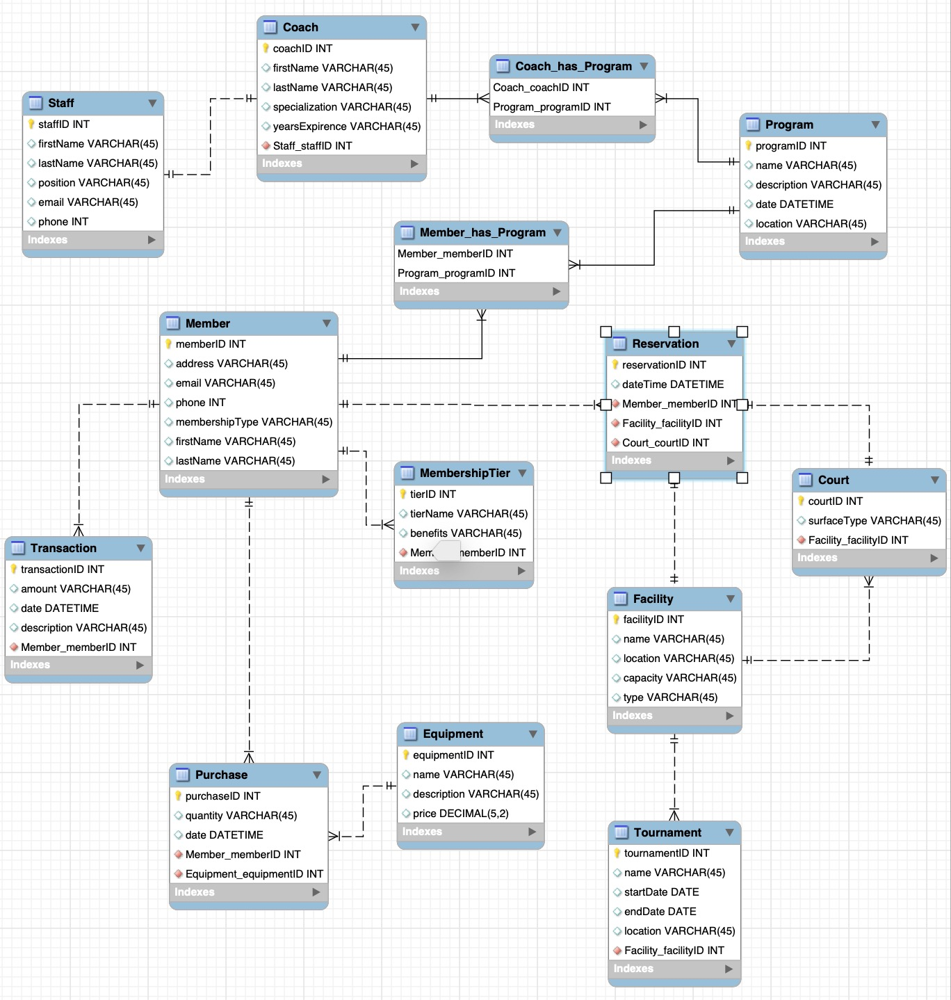

# Team X MIST 4610 Group Project 1
## Team Name
## Team Members
## Problem Description
This project focuses on building a relational database for the "Ace All Stars Tennis Club" located in the heart of Athens, Georgia. The club caters to a diverse community of tennis enthusiasts, including both professional and amateur players, as well as individuals of all ages and skill levels. We hope to provide a database that can accurately represent the relationships between members, coaches, staff and their use of the different tennis equipment and facilities. The various events, tournaments, and programs would also benefit from a relational database to track their involvement, location, and other key details.

## Data Model
Our model is based on the structure of the Ace All Stars Tennis Club. This club involves complex relationships between members’, coaches’ , and staff’s interactions with purchasing tennis equipment, participating in programs and tournaments, and reserving certain courts or facilities. 

Each member belongs to a specific membership tier, and each membership tier can have multiple members with the same benefits. A member can book multiple tennis court reservations, make multiple financial transactions within the club, and purchase multiple pieces of equipment, while each of these interactions will only be linked to one member’s ID. 

Each purchase is for a specific piece of equipment, and multiple purchase records can be associated with the same equipment item.

Each coach is a staff member, and each staff member can be designated as a coach within the club. 

Involving the tennis programs provided by the club, each coach or member can participate in multiple tennis programs, and each tennis program can have multiple coaches or members involved. These two scenarios are Many-to-Many relationships which require a junction table. 

Members also have the ability to reserve a certain court and or facility for their personal use. Each reservation is made by a single member, and multiple reservations can be associated with the same member, reflecting their booking history. A court can have multiple reservations for various time slots, and each reservation is linked to a specific court for a particular time and date. Multiple courts can be part of the same facility, such as a tennis complex or a sports center. However, each court is associated with only one specific facility.

## Data Dictionary
## Queries
1. Q1
2. Q2
3. ...
## Database Information
