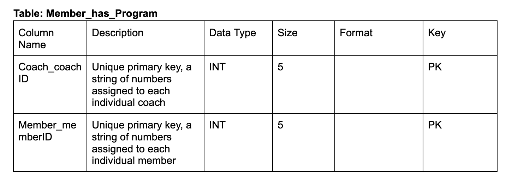

# Team X MIST 4610 Group Project 1
## Team Name
15061 Group 
## Team Members
1. Megan Aldinger [@meganaldinger](https://github.com/meganaldinger)
2. Ronit Subramanian [@ronsub101](https://github.com/ronsub101)
## Problem Description
This project focuses on building a relational database for the "Ace All Stars Tennis Club" located in the heart of Athens, Georgia. The club caters to a diverse community of tennis enthusiasts, including both professional and amateur players, as well as individuals of all ages and skill levels. We hope to provide a database that can accurately represent the relationships between members, coaches, staff and their use of the different tennis equipment and facilities. The various events, tournaments, and programs would also benefit from a relational database to track their involvement, location, and other key details.

## Data Model
Our model is based on the structure of the Ace All Stars Tennis Club. This club involves complex relationships between members’, coaches’ , and staff’s interactions with purchasing tennis equipment, participating in programs and tournaments, and reserving certain courts or facilities. 

Each member belongs to a specific membership tier, and each membership tier can have multiple members with the same benefits. A member can book multiple tennis court reservations, make multiple financial transactions within the club, and purchase multiple pieces of equipment, while each of these interactions will only be linked to one member’s ID. 

Each purchase is for a specific piece of equipment, and multiple purchase records can be associated with the same equipment item.

Each coach is a staff member, and each staff member can be designated as a coach within the club. 

Involving the tennis programs provided by the club, each coach or member can participate in multiple tennis programs, and each tennis program can have multiple coaches or members involved. These two scenarios are Many-to-Many relationships which require a junction table. 

Members also have the ability to reserve a certain court and or facility for their personal use. Each reservation is made by a single member, and multiple reservations can be associated with the same member, reflecting their booking history. A court can have multiple reservations for various time slots, and each reservation is linked to a specific court for a particular time and date. Multiple courts can be part of the same facility, such as a tennis complex or a sports center. However, each court is associated with only one specific facility.

## Data Dictionary

## Queries
1. Query 1
This query lists members, the tournaments they have participated in, and the facilities where the tournaments took place, and then groups the results by member. This would be useful for managers to be able to track a certain member’s tournament participation and reach out to them for upcoming tournaments.

2. Query 2
This query retrieves a list of members who have not made any reservations through using NOT EXISTS. This would allow managers to analyze which members are least involved in the personal use of club facilities and courts, and possibly reach out to them to keep them an engaged member.

3. Query 3
This query retrieves facilities that have multiple courts. This would allow managers to narrow down which facilities would be best to book events such as large tournaments.

4. Query 4
This query retrieves data about membership tiers, equipment, and purchases based on the specified conditions and regular expression matching. 

5.Query 5
This query retrieves members, their associated tournaments, and counts their reservations, but only for tournaments in the year 2023. This would allow club managers to see who are the most recently engaged members of the club and possible reach out to them about upgrading their memebership tier.

6. Query 6
This query retrieves equipment names and their total quantities purchased, but only for equipment with quantities greater than the average quantity purchased in the specified date range. This will allow managers of the sales aspect of the club to discover the most popular recent items. This might change how they order stock or update prices.

7. Query 7 needs to be redone

8. Query 8
This query finds facilities that have had more than 5 tournaments and then sorts them by location. This would allow staff to find the most popular and closest facilities while organizing an upcoming tournament. 

9. Query 9: 
This query provides valuable insights into the total amount spent on equipment and the total quantity of items purchased by each member. This information can help them identify the most active and valuable members within the club, and assess the profitability of the equipment sales aspect of the business.

10. Query 10
This query can provide insights into the popularity of different tennis programs among the members. It takes the count of the members in each program to see which ones are most popular, and then sorts those results by program name. This information can help them identify the most sought-after programs and tailor their offerings to meet the demands. 

## Database Information
